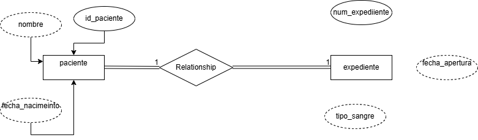
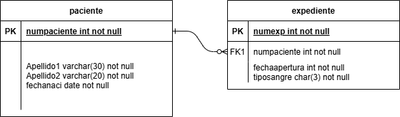
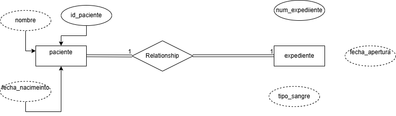
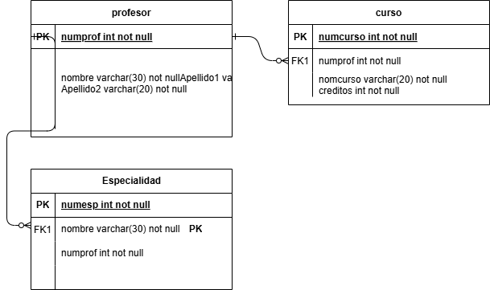
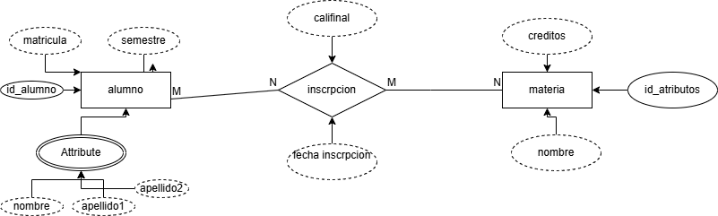
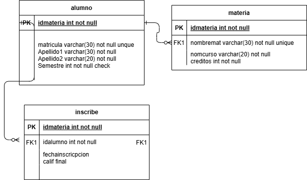
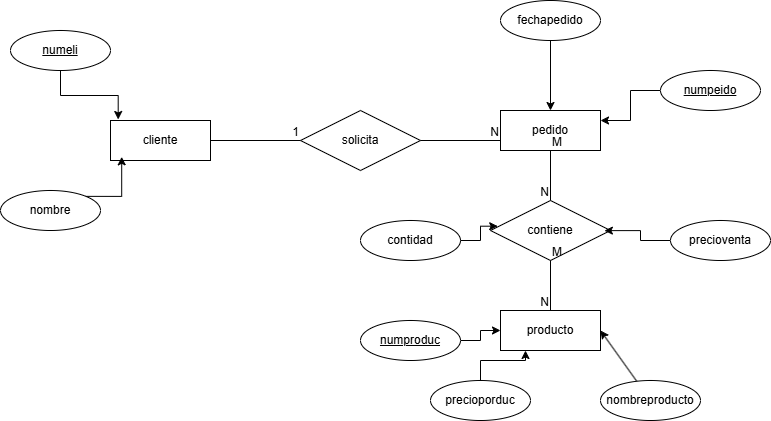
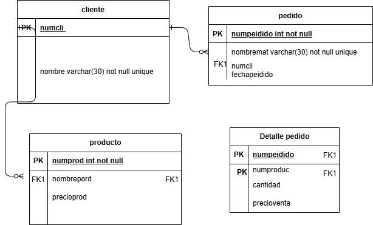
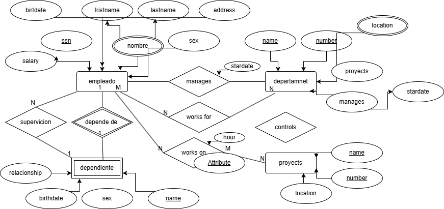
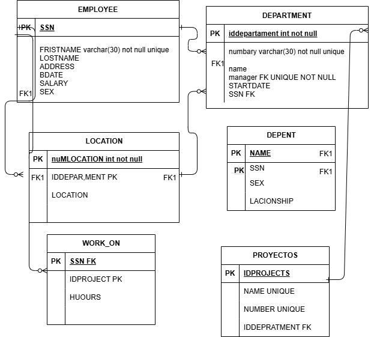

# ejecicicos relacional 

## Solucion del ejecicico

## Mapeo E-R RELACIONAL

## Solucion del ejecicico

## Mapeo E-R RELACIONAL

## Solucion del ejecicico

## Mapeo E-R RELACIONAL

## Solucion del ejecicico

## Mapeo E-R RELACIONAL

## Solucion del ejecicico

## Mapeo E-R RELACIONAL

