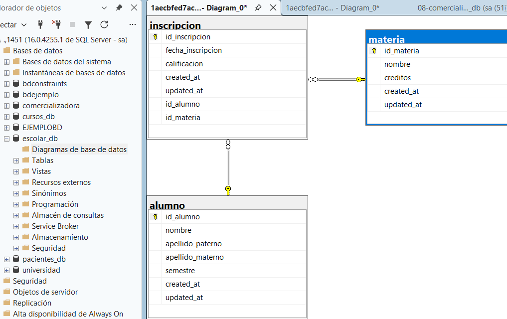

/*=========================================================
    CREAR LA BASE DE DATOS
=========================================================*/
CREATE DATABASE escolar_db;
GO

/*=========================================================
    UTILIZAR LA BASE DE DATOS
=========================================================*/
USE escolar_db;
GO

/*=========================================================
    CREAR TABLA ALUMNO
=========================================================*/
CREATE TABLE alumno(
	id_alumno INT NOT NULL IDENTITY(1,1)
	CONSTRAINT pk_alumno
	PRIMARY KEY,

	nombre VARCHAR(50) NOT NULL,

	apellido_paterno VARCHAR(50) NOT NULL,

	apellido_materno VARCHAR(50) NOT NULL,

	semestre INT NOT NULL
	CONSTRAINT ck_alumno_semestre
	CHECK (semestre BETWEEN 1 AND 12),

	created_at DATETIME2 NOT NULL
	CONSTRAINT df_alumno_created_at
	DEFAULT SYSDATETIME(),

	updated_at DATETIME2 NOT NULL
	CONSTRAINT df_alumno_updated_at
	DEFAULT SYSDATETIME()
);
GO

/*=========================================================
    CREAR TABLA MATERIA
=========================================================*/
CREATE TABLE materia(
	id_materia INT NOT NULL IDENTITY(1,1)
	CONSTRAINT pk_materia
	PRIMARY KEY,

	nombre VARCHAR(100) NOT NULL
	CONSTRAINT uq_materia_nombre
	UNIQUE,

	creditos INT NOT NULL
	CONSTRAINT ck_materia_creditos
	CHECK (creditos > 0),

	created_at DATETIME2 NOT NULL
	CONSTRAINT df_materia_created_at
	DEFAULT SYSDATETIME(),

	updated_at DATETIME2 NOT NULL
	CONSTRAINT df_materia_updated_at
	DEFAULT SYSDATETIME()
);
GO

/*=========================================================
    CREAR TABLA INSCRIPCION
=========================================================*/
CREATE TABLE inscripcion(
	id_inscripcion INT NOT NULL IDENTITY(1,1)
	CONSTRAINT pk_inscripcion
	PRIMARY KEY,

	fecha_inscripcion DATE NOT NULL
	CONSTRAINT df_inscripcion_fecha
	DEFAULT GETDATE(),

	calificacion DECIMAL(4,2) NULL
	CONSTRAINT ck_inscripcion_calificacion
	CHECK (calificacion BETWEEN 0 AND 10),

	created_at DATETIME2 NOT NULL
	CONSTRAINT df_inscripcion_created_at
	DEFAULT SYSDATETIME(),

	updated_at DATETIME2 NOT NULL
	CONSTRAINT df_inscripcion_updated_at
	DEFAULT SYSDATETIME(),

	id_alumno INT NOT NULL,

	id_materia INT NOT NULL,

	CONSTRAINT fk_inscripcion_alumno
	FOREIGN KEY (id_alumno)
	REFERENCES alumno(id_alumno),

	CONSTRAINT fk_inscripcion_materia
	FOREIGN KEY (id_materia)
	REFERENCES materia(id_materia)
);
GO

