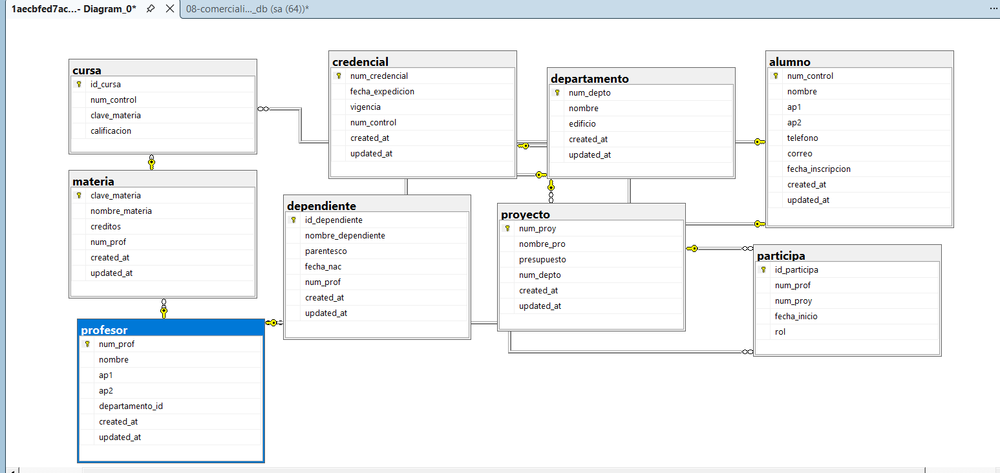

/*=========================================================
    CREAR LA BASE DE DATOS
=========================================================*/
CREATE DATABASE universidad_db;
GO

/*=========================================================
    UTILIZAR LA BASE DE DATOS
=========================================================*/
USE universidad_db;
GO

/*=========================================================
    CREAR TABLA ALUMNO
=========================================================*/
CREATE TABLE alumno(
	num_control VARCHAR(10) NOT NULL
	CONSTRAINT pk_alumno
	PRIMARY KEY,

	nombre VARCHAR(50) NOT NULL,

	ap1 VARCHAR(50) NOT NULL,

	ap2 VARCHAR(50) NOT NULL,

	telefono VARCHAR(15),

	correo VARCHAR(100)
	CONSTRAINT uq_alumno_correo
	UNIQUE,

	fecha_inscripcion DATE NOT NULL,

	created_at DATETIME2 NOT NULL
	CONSTRAINT df_alumno_created_at
	DEFAULT SYSDATETIME(),

	updated_at DATETIME2 NOT NULL
	CONSTRAINT df_alumno_updated_at
	DEFAULT SYSDATETIME()
);
GO

/*=========================================================
    CREAR TABLA CREDENCIAL
=========================================================*/
CREATE TABLE credencial(
	num_credencial VARCHAR(20) NOT NULL
	CONSTRAINT pk_credencial
	PRIMARY KEY,

	fecha_expedicion DATE NOT NULL,

	vigencia DATE NOT NULL,

	num_control VARCHAR(10) NOT NULL
	CONSTRAINT uq_credencial_alumno
	UNIQUE,

	created_at DATETIME2 NOT NULL
	CONSTRAINT df_credencial_created_at
	DEFAULT SYSDATETIME(),

	updated_at DATETIME2 NOT NULL
	CONSTRAINT df_credencial_updated_at
	DEFAULT SYSDATETIME(),

	CONSTRAINT fk_credencial_alumno
	FOREIGN KEY(num_control)
	REFERENCES alumno(num_control)
);
GO

/*=========================================================
    CREAR TABLA DEPARTAMENTO
=========================================================*/
CREATE TABLE departamento(
	num_depto INT NOT NULL IDENTITY(1,1)
	CONSTRAINT pk_departamento
	PRIMARY KEY,

	nombre VARCHAR(100) NOT NULL,

	edificio VARCHAR(50) NOT NULL,

	created_at DATETIME2 NOT NULL
	CONSTRAINT df_departamento_created_at
	DEFAULT SYSDATETIME(),

	updated_at DATETIME2 NOT NULL
	CONSTRAINT df_departamento_updated_at
	DEFAULT SYSDATETIME()
);
GO

/*=========================================================
    CREAR TABLA PROFESOR
=========================================================*/
CREATE TABLE profesor(
	num_prof VARCHAR(10) NOT NULL
	CONSTRAINT pk_profesor
	PRIMARY KEY,

	nombre VARCHAR(50) NOT NULL,

	ap1 VARCHAR(50) NOT NULL,

	ap2 VARCHAR(50) NOT NULL,

	departamento_id INT NOT NULL,

	created_at DATETIME2 NOT NULL
	CONSTRAINT df_profesor_created_at
	DEFAULT SYSDATETIME(),

	updated_at DATETIME2 NOT NULL
	CONSTRAINT df_profesor_updated_at
	DEFAULT SYSDATETIME(),

	CONSTRAINT fk_profesor_departamento
	FOREIGN KEY(departamento_id)
	REFERENCES departamento(num_depto)
);
GO

/*=========================================================
    CREAR TABLA MATERIA
=========================================================*/
CREATE TABLE materia(
	clave_materia VARCHAR(10) NOT NULL
	CONSTRAINT pk_materia
	PRIMARY KEY,

	nombre_materia VARCHAR(100) NOT NULL,

	creditos INT NOT NULL
	CONSTRAINT ck_materia_creditos
	CHECK(creditos>0),

	num_prof VARCHAR(10) NOT NULL,

	created_at DATETIME2 NOT NULL
	CONSTRAINT df_materia_created_at
	DEFAULT SYSDATETIME(),

	updated_at DATETIME2 NOT NULL
	CONSTRAINT df_materia_updated_at
	DEFAULT SYSDATETIME(),

	CONSTRAINT fk_materia_profesor
	FOREIGN KEY(num_prof)
	REFERENCES profesor(num_prof)
);
GO

/*=========================================================
    CREAR TABLA PROYECTO
=========================================================*/
CREATE TABLE proyecto(
	num_proy INT NOT NULL IDENTITY(1,1)
	CONSTRAINT pk_proyecto
	PRIMARY KEY,

	nombre_pro VARCHAR(100) NOT NULL,

	presupuesto DECIMAL(12,2) NOT NULL
	CONSTRAINT ck_proyecto_presupuesto
	CHECK(presupuesto>0),

	num_depto INT NOT NULL,

	created_at DATETIME2 NOT NULL
	CONSTRAINT df_proyecto_created_at
	DEFAULT SYSDATETIME(),

	updated_at DATETIME2 NOT NULL
	CONSTRAINT df_proyecto_updated_at
	DEFAULT SYSDATETIME(),

	CONSTRAINT fk_proyecto_departamento
	FOREIGN KEY(num_depto)
	REFERENCES departamento(num_depto)
);
GO

/*=========================================================
    CREAR TABLA DEPENDIENTE
=========================================================*/
CREATE TABLE dependiente(
	id_dependiente INT NOT NULL IDENTITY(1,1)
	CONSTRAINT pk_dependiente
	PRIMARY KEY,

	nombre_dependiente VARCHAR(100) NOT NULL,

	parentesco VARCHAR(50) NOT NULL,

	fecha_nac DATE NOT NULL,

	num_prof VARCHAR(10) NOT NULL,

	created_at DATETIME2 NOT NULL
	CONSTRAINT df_dependiente_created_at
	DEFAULT SYSDATETIME(),

	updated_at DATETIME2 NOT NULL
	CONSTRAINT df_dependiente_updated_at
	DEFAULT SYSDATETIME(),

	CONSTRAINT fk_dependiente_profesor
	FOREIGN KEY(num_prof)
	REFERENCES profesor(num_prof)
);
GO

/*=========================================================
    CREAR TABLA CURSA (N:M)
=========================================================*/
CREATE TABLE cursa(
	id_cursa INT NOT NULL IDENTITY(1,1)
	CONSTRAINT pk_cursa
	PRIMARY KEY,

	num_control VARCHAR(10) NOT NULL,

	clave_materia VARCHAR(10) NOT NULL,

	calificacion DECIMAL(4,2)
	CONSTRAINT ck_cursa_calificacion
	CHECK(calificacion BETWEEN 0 AND 10),

	CONSTRAINT fk_cursa_alumno
	FOREIGN KEY(num_control)
	REFERENCES alumno(num_control),

	CONSTRAINT fk_cursa_materia
	FOREIGN KEY(clave_materia)
	REFERENCES materia(clave_materia)
);
GO

/*=========================================================
    CREAR TABLA PARTICIPA (N:M)
=========================================================*/
CREATE TABLE participa(
	id_participa INT NOT NULL IDENTITY(1,1)
	CONSTRAINT pk_participa
	PRIMARY KEY,

	num_prof VARCHAR(10) NOT NULL,

	num_proy INT NOT NULL,

	fecha_inicio DATE NOT NULL,

	rol VARCHAR(50),

	CONSTRAINT fk_participa_profesor
	FOREIGN KEY(num_prof)
	REFERENCES profesor(num_prof),

	CONSTRAINT fk_participa_proyecto
	FOREIGN KEY(num_proy)
	REFERENCES proyecto(num_proy)
);
GO

