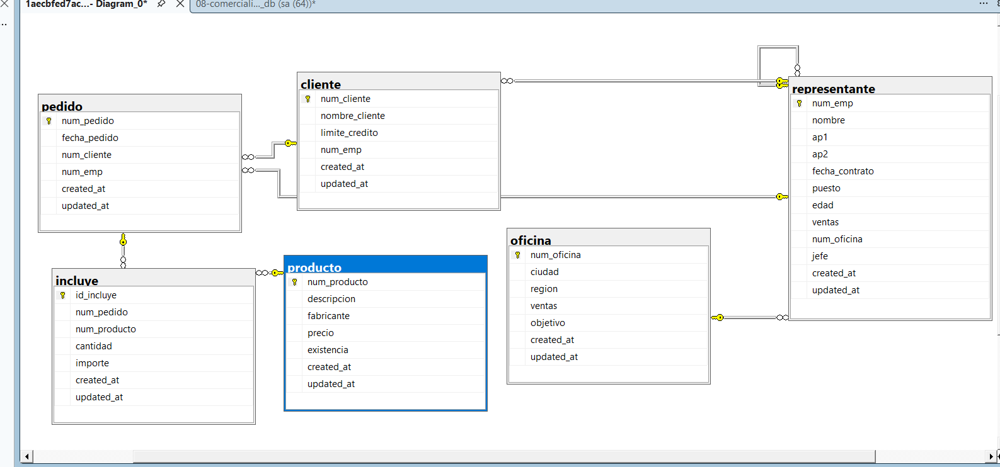

/*=========================================================
    CREAR LA BASE DE DATOS
=========================================================*/
CREATE DATABASE empresa2_db;
GO

/*=========================================================
    UTILIZAR LA BASE DE DATOS
=========================================================*/
USE empresa2_db;
GO

/*=========================================================
    CREAR TABLA DEPARTAMENTO
=========================================================*/
CREATE TABLE departamento(
	clave_departamento INT NOT NULL IDENTITY(1,1)
	CONSTRAINT pk_departamento
	PRIMARY KEY,

	nombre VARCHAR(100) NOT NULL,

	ubicacion VARCHAR(100) NOT NULL,

	presupuesto DECIMAL(12,2) NOT NULL
	CONSTRAINT ck_departamento_presupuesto
	CHECK(presupuesto>0),

	created_at DATETIME2 NOT NULL
	CONSTRAINT df_departamento_created_at
	DEFAULT SYSDATETIME(),

	updated_at DATETIME2 NOT NULL
	CONSTRAINT df_departamento_updated_at
	DEFAULT SYSDATETIME()
);
GO

/*=========================================================
    CREAR TABLA PUESTO
=========================================================*/
CREATE TABLE puesto(
	clave INT NOT NULL IDENTITY(1,1)
	CONSTRAINT pk_puesto
	PRIMARY KEY,

	nombre VARCHAR(100) NOT NULL,

	salario_min DECIMAL(10,2) NOT NULL
	CONSTRAINT ck_puesto_salario_min
	CHECK(salario_min>0),

	salario_max DECIMAL(10,2) NOT NULL
	CONSTRAINT ck_puesto_salario_max
	CHECK(salario_max>=salario_min),

	nivel_jerarquico VARCHAR(50) NOT NULL,

	created_at DATETIME2 NOT NULL
	CONSTRAINT df_puesto_created_at
	DEFAULT SYSDATETIME(),

	updated_at DATETIME2 NOT NULL
	CONSTRAINT df_puesto_updated_at
	DEFAULT SYSDATETIME()
);
GO

/*=========================================================
    CREAR TABLA SUCURSAL
=========================================================*/
CREATE TABLE sucursal(
	clave INT NOT NULL IDENTITY(1,1)
	CONSTRAINT pk_sucursal
	PRIMARY KEY,

	nombre VARCHAR(100) NOT NULL,

	ciudad VARCHAR(50) NOT NULL,

	estado VARCHAR(50) NOT NULL,

	telefono VARCHAR(20),

	created_at DATETIME2 NOT NULL
	CONSTRAINT df_sucursal_created_at
	DEFAULT SYSDATETIME(),

	updated_at DATETIME2 NOT NULL
	CONSTRAINT df_sucursal_updated_at
	DEFAULT SYSDATETIME()
);
GO

/*=========================================================
    CREAR TABLA EMPLEADO
=========================================================*/
CREATE TABLE empleado(
	num_empleado INT NOT NULL IDENTITY(1,1)
	CONSTRAINT pk_empleado
	PRIMARY KEY,

	nombre VARCHAR(50) NOT NULL,

	ap1 VARCHAR(50) NOT NULL,

	ap2 VARCHAR(50) NOT NULL,

	correo VARCHAR(100)
	CONSTRAINT uq_empleado_correo
	UNIQUE,

	fecha_nac DATE NOT NULL,

	departamento_id INT NOT NULL,

	puesto_id INT NOT NULL,

	jefe_id INT NULL,

	created_at DATETIME2 NOT NULL
	CONSTRAINT df_empleado_created_at
	DEFAULT SYSDATETIME(),

	updated_at DATETIME2 NOT NULL
	CONSTRAINT df_empleado_updated_at
	DEFAULT SYSDATETIME(),

	CONSTRAINT fk_empleado_departamento
	FOREIGN KEY(departamento_id)
	REFERENCES departamento(clave_departamento),

	CONSTRAINT fk_empleado_puesto
	FOREIGN KEY(puesto_id)
	REFERENCES puesto(clave)
);
GO

/*=========================================================
    AUTORRELACION EMPLEADO -> JEFE
=========================================================*/
ALTER TABLE empleado
ADD CONSTRAINT fk_empleado_jefe
FOREIGN KEY(jefe_id)
REFERENCES empleado(num_empleado);
GO

/*=========================================================
    CREAR TABLA PROYECTO
=========================================================*/
CREATE TABLE proyecto(
	clave INT NOT NULL IDENTITY(1,1)
	CONSTRAINT pk_proyecto
	PRIMARY KEY,

	nombre VARCHAR(100) NOT NULL,

	presupuesto DECIMAL(12,2) NOT NULL
	CONSTRAINT ck_proyecto_presupuesto
	CHECK(presupuesto>0),

	fecha_inicio DATE NOT NULL,

	fecha_fin DATE NULL,

	created_at DATETIME2 NOT NULL
	CONSTRAINT df_proyecto_created_at
	DEFAULT SYSDATETIME(),

	updated_at DATETIME2 NOT NULL
	CONSTRAINT df_proyecto_updated_at
	DEFAULT SYSDATETIME()
);
GO

/*=========================================================
    CREAR TABLA CAPACITACION
=========================================================*/
CREATE TABLE capacitacion(
	id_capacitacion INT NOT NULL IDENTITY(1,1)
	CONSTRAINT pk_capacitacion
	PRIMARY KEY,

	fecha DATE NOT NULL,

	departamento_id INT NOT NULL,

	created_at DATETIME2 NOT NULL
	CONSTRAINT df_capacitacion_created_at
	DEFAULT SYSDATETIME(),

	updated_at DATETIME2 NOT NULL
	CONSTRAINT df_capacitacion_updated_at
	DEFAULT SYSDATETIME(),

	CONSTRAINT fk_capacitacion_departamento
	FOREIGN KEY(departamento_id)
	REFERENCES departamento(clave_departamento)
);
GO

/*=========================================================
    TABLA PARTICIPA (EMPLEADO - PROYECTO)
=========================================================*/
CREATE TABLE participa(
	id_participa INT NOT NULL IDENTITY(1,1)
	CONSTRAINT pk_participa
	PRIMARY KEY,

	num_empleado INT NOT NULL,

	clave_proyecto INT NOT NULL,

	rol VARCHAR(50),

	horas DECIMAL(5,2),

	fecha_asignacion DATE NOT NULL,

	CONSTRAINT fk_participa_empleado
	FOREIGN KEY(num_empleado)
	REFERENCES empleado(num_empleado),

	CONSTRAINT fk_participa_proyecto
	FOREIGN KEY(clave_proyecto)
	REFERENCES proyecto(clave)
);
GO

/*=========================================================
    TABLA ASISTIR (EMPLEADO - CAPACITACION)
=========================================================*/
CREATE TABLE asistir(
	id_asistencia INT NOT NULL IDENTITY(1,1)
	CONSTRAINT pk_asistir
	PRIMARY KEY,

	num_empleado INT NOT NULL,

	id_capacitacion INT NOT NULL,

	calificacion DECIMAL(4,2)
	CONSTRAINT ck_asistir_calificacion
	CHECK(calificacion BETWEEN 0 AND 10),

	estatus VARCHAR(30),

	CONSTRAINT fk_asistir_empleado
	FOREIGN KEY(num_empleado)
	REFERENCES empleado(num_empleado),

	CONSTRAINT fk_asistir_capacitacion
	FOREIGN KEY(id_capacitacion)
	REFERENCES capacitacion(id_capacitacion)
);
GO

/*=========================================================
    AGREGAR FK DE PUESTO A SUCURSAL
=========================================================*/
ALTER TABLE puesto
ADD sucursal_id INT NOT NULL;
GO

ALTER TABLE puesto
ADD CONSTRAINT fk_puesto_sucursal
FOREIGN KEY(sucursal_id)
REFERENCES sucursal(clave);
GO

